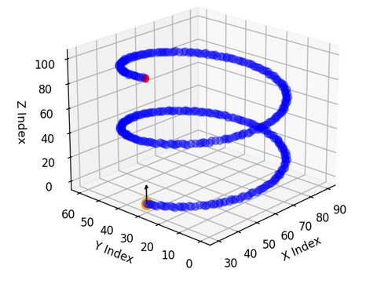
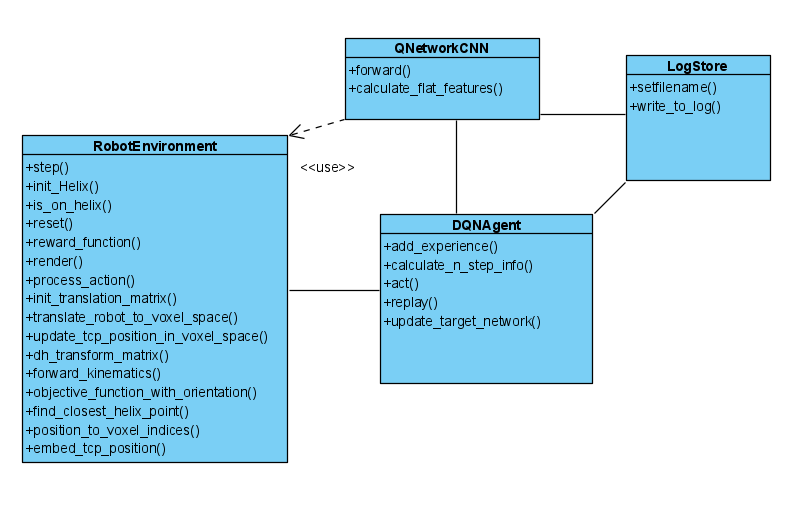

# Robotproject with Reinforcement Learning

## Introduction
The aim of this project was to train a 6-axis robot arm using reinforcement learning so that it learns to track a helix.
Therefore we implemented Deep Q-Learning with a Late Fusion Multimodal Model that uses a CNN Network for the spatial features and
gets the orientation features concatenated into the fully connected layers directly.
The replay memory works on basis of n-step-bootstrapping.

## Installation
Follow these steps to install our project

      git clone https://github.com/7AtAri/Robot_ReinforcementLearning.git

Install the required dependencies 

      python -m pip install --upgrade pip
      python -m pip install -r requirements.txt

## Different Branches
We have two different branches that have different Deep Q-Networks implemented.

1. "main" branch

The main file of the 'main' branch is a jupyter notebook in the folder "code":

Multimodal_Deep_Q_Learning.ipynb

To run [the main notebook](https://github.com/7AtAri/Robot_ReinforcementLearning/blob/main/code/Multimodal_Deep_Q_Learning.ipynb), please click through its cells from top to bottom.

Hre we work with a Late Fusion Convolutional neural network (CNN) which can operate with 3D data and the orientation of TCP that is inserted just in the Fully Connected Layer (FC).

2. "working-secondbranch"

in that Version we also work with a CNN but we are not using the orientation of the TCP.

The main files of 'working-secondbranch' are in the folder "code":

* n-step-bootstrapping.py
* Environment-cnn.py

To run the project please run the file [n-step-bootstrapping.py](https://github.com/7AtAri/Robot_ReinforcementLearning/blob/working-secondbranch/code/n-step-bootstrapping.py)

## Usage
 In our environment we use the following functions based on the gymnasium environment

 - step(): updates the environment based on the actions of the agent

 - Reset(): resets the environment to initial settings (TCP on Startposition, Reard to zero, Observation, Kinematics)

 - render(): to visualize the Helix, current TCP position with current orientation (arrow) and the target voxel
 

Here you can see the model of our environment in which the robotarm is trained

## Overview with Class Diagramm
In the following figure you can see a class diagramm to give an overview of our Code...

## Presentation of the project:

[slideshow](https://docs.google.com/presentation/d/1K-Z_9DINiN5YOrNhcSbybdJc9_H6uGj8DYdVeNjimRg/edit?usp=sharing)

